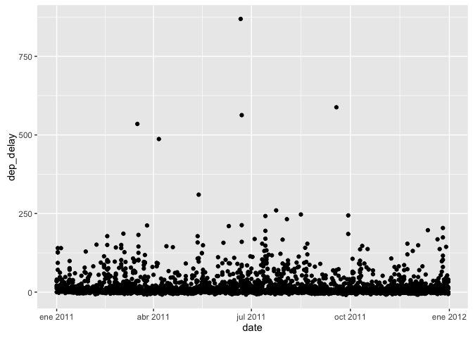
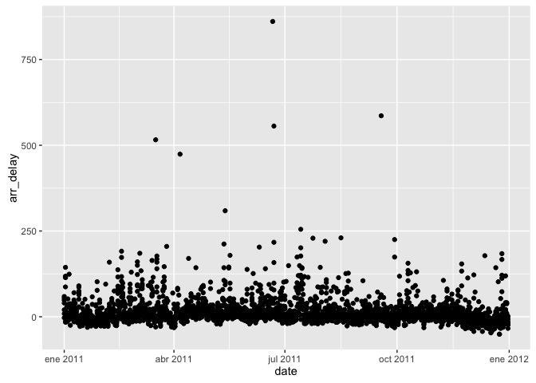
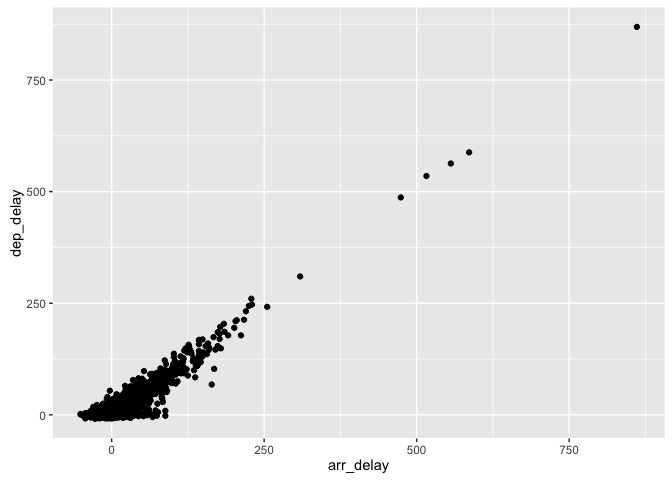
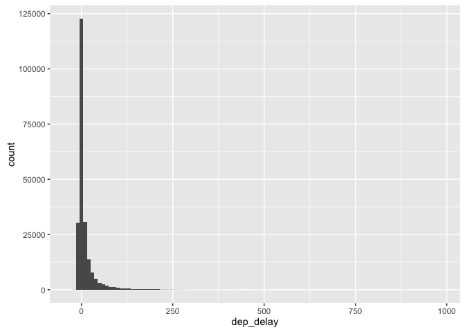
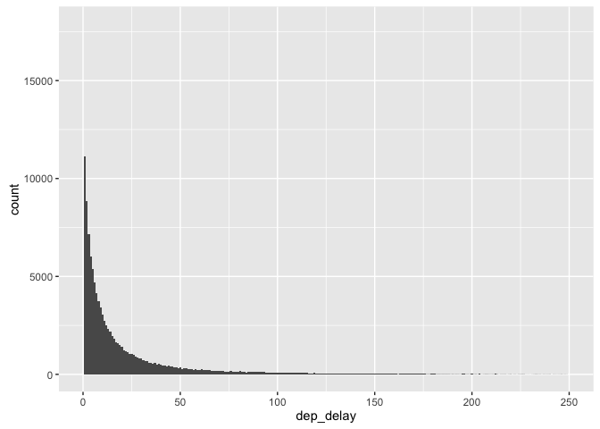
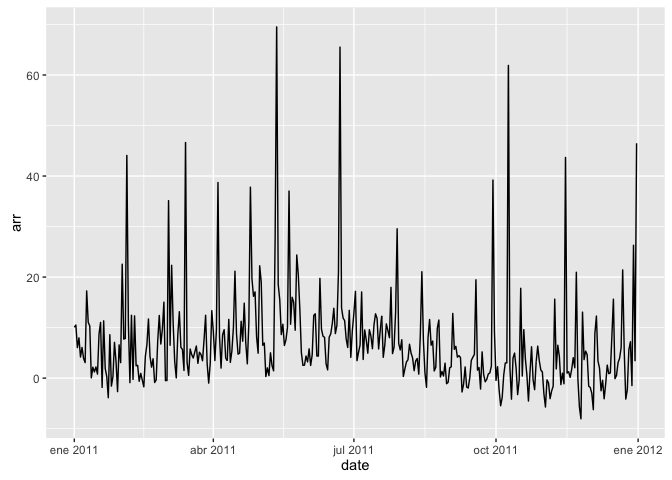

Manipulación de datos
================

Data analysis is the process by which data becomes understanding, knowledge and insight

Control Structures
------------------

### Hoy veremos

-   `if`,`else`,`for`,`while`,`repeat`,`break`,`next`,`return`

#### if, else

This is an R Markdown format used for publishing markdown documents to GitHub. When you click the **Knit** button all R code chunks are run and a markdown file (.md) suitable for publishing to GitHub is generated.

``` r
setwd("~/Documents/GitHub/R-Introductory-Course")
suppressMessages(library(dplyr, quietly = T))
library(ggplot2, quietly = T)

flights <- tbl_df(read.csv("data/flights.csv", stringsAsFactors = FALSE))
flights$date <- as.Date(flights$date)

weather <- tbl_df(read.csv("data/weather.csv", stringsAsFactors = FALSE))
weather$date <- as.Date(weather$date)

planes <- tbl_df(read.csv("data/planes.csv", stringsAsFactors = FALSE))

airports <- tbl_df(read.csv("data/airports.csv", stringsAsFactors = FALSE))

flights
```

    ## Source: local data frame [227,496 x 14]
    ## 
    ##          date  hour minute   dep   arr dep_delay arr_delay carrier flight
    ##        (date) (int)  (int) (int) (int)     (int)     (int)   (chr)  (int)
    ## 1  2011-01-01    14      0  1400  1500         0       -10      AA    428
    ## 2  2011-01-02    14      1  1401  1501         1        -9      AA    428
    ## 3  2011-01-03    13     52  1352  1502        -8        -8      AA    428
    ## 4  2011-01-04    14      3  1403  1513         3         3      AA    428
    ## 5  2011-01-05    14      5  1405  1507         5        -3      AA    428
    ## 6  2011-01-06    13     59  1359  1503        -1        -7      AA    428
    ## 7  2011-01-07    13     59  1359  1509        -1        -1      AA    428
    ## 8  2011-01-08    13     55  1355  1454        -5       -16      AA    428
    ## 9  2011-01-09    14     43  1443  1554        43        44      AA    428
    ## 10 2011-01-10    14     43  1443  1553        43        43      AA    428
    ## ..        ...   ...    ...   ...   ...       ...       ...     ...    ...
    ## Variables not shown: dest (chr), plane (chr), cancelled (int), time (int),
    ##   dist (int)

``` r
weather
```

    ## Source: local data frame [8,723 x 14]
    ## 
    ##          date  hour  temp dew_point humidity pressure visibility wind_dir
    ##        (date) (int) (dbl)     (dbl)    (int)    (dbl)      (dbl)    (chr)
    ## 1  2011-01-01     0  59.0      28.9       32    29.86         10      NNE
    ## 2  2011-01-01     1  57.2      28.4       33    29.88         10      NNE
    ## 3  2011-01-01     2  55.4      28.4       36    29.93         10      NNW
    ## 4  2011-01-01     3  53.6      28.4       38    29.94         10    North
    ## 5  2011-01-01     4    NA        NA       NA    29.99         10      NNW
    ## 6  2011-01-01     5    NA        NA       NA    30.02         10    North
    ## 7  2011-01-01     6  53.1      17.1       24    30.05         10    North
    ## 8  2011-01-01     7  53.1      16.0       23    30.07         10    North
    ## 9  2011-01-01     8  54.0      18.0       24    30.09         10    North
    ## 10 2011-01-01     9  55.4      17.6       23    30.09         10      NNE
    ## ..        ...   ...   ...       ...      ...      ...        ...      ...
    ## Variables not shown: wind_dir2 (int), wind_speed (dbl), gust_speed (dbl),
    ##   precip (dbl), conditions (chr), events (chr)

``` r
planes
```

    ## Source: local data frame [2,853 x 9]
    ## 
    ##     plane  year               mfr          model no.eng no.seats speed
    ##     (chr) (int)             (chr)          (chr)  (int)    (int) (int)
    ## 1  N576AA  1991 MCDONNELL DOUGLAS DC-9-82(MD-82)      2      172    NA
    ## 2  N557AA  1993        MARZ BARRY      KITFOX IV      1        2    NA
    ## 3  N403AA  1974             RAVEN           S55A     NA        1    60
    ## 4  N492AA  1989 MCDONNELL DOUGLAS DC-9-82(MD-82)      2      172    NA
    ## 5  N262AA  1985 MCDONNELL DOUGLAS DC-9-82(MD-82)      2      172    NA
    ## 6  N493AA  1989 MCDONNELL DOUGLAS DC-9-82(MD-82)      2      172    NA
    ## 7  N477AA  1988 MCDONNELL DOUGLAS DC-9-82(MD-82)      2      172    NA
    ## 8  N476AA  1988 MCDONNELL DOUGLAS DC-9-82(MD-82)      2      172    NA
    ## 9  N504AA    NA AUTHIER ANTHONY P      TIERRA II      1        2    NA
    ## 10 N565AA  1987 MCDONNELL DOUGLAS DC-9-83(MD-83)      2      172    NA
    ## ..    ...   ...               ...            ...    ...      ...   ...
    ## Variables not shown: engine (chr), type (chr)

``` r
airports
```

    ## Source: local data frame [3,376 x 7]
    ## 
    ##     iata              airport             city state country      lat
    ##    (chr)                (chr)            (chr) (chr)   (chr)    (dbl)
    ## 1    00M             Thigpen       Bay Springs    MS     USA 31.95376
    ## 2    00R Livingston Municipal       Livingston    TX     USA 30.68586
    ## 3    00V          Meadow Lake Colorado Springs    CO     USA 38.94575
    ## 4    01G         Perry-Warsaw            Perry    NY     USA 42.74135
    ## 5    01J     Hilliard Airpark         Hilliard    FL     USA 30.68801
    ## 6    01M    Tishomingo County          Belmont    MS     USA 34.49167
    ## 7    02A          Gragg-Wade           Clanton    AL     USA 32.85049
    ## 8    02C              Capitol       Brookfield    WI     USA 43.08751
    ## 9    02G    Columbiana County   East Liverpool    OH     USA 40.67331
    ## 10   03D     Memphis Memorial          Memphis    MO     USA 40.44726
    ## ..   ...                  ...              ...   ...     ...      ...
    ## Variables not shown: long (dbl)

``` r
for (obj in ls()) { 
  message(obj); 
  print(object.size(get(obj)), units='auto')
  }
```

    ## airports

    ## 691.2 Kb

    ## flights

    ## 15.8 Mb

    ## planes

    ## 301.1 Kb

    ## weather

    ## 856.9 Kb

Primeros verbos \* `filter`,`select`,`for`,`arrange`,`mutate`,`summarise`

#### filter

**Ejemplo:**

``` r
sfo <- filter(flights, dest == "SFO")
qplot(date, dep_delay, data = sfo)
```

    ## Warning: Removed 14 rows containing missing values (geom_point).



``` r
qplot(date, arr_delay, data = sfo)
```

    ## Warning: Removed 18 rows containing missing values (geom_point).



``` r
qplot(arr_delay, dep_delay, data = sfo)
```

    ## Warning: Removed 18 rows containing missing values (geom_point).

 **Gráficos de frecuencia**

``` r
qplot(dep_delay, data = flights, binwidth = 10)
```

    ## Warning: Removed 2905 rows containing non-finite values (stat_bin).



``` r
qplot(dep_delay, data = flights, binwidth = 1) + xlim(0, 250)
```

    ## Warning: Removed 99934 rows containing non-finite values (stat_bin).



#### group\_by y summarise

``` r
by_day <- group_by(flights, date)
by_day
```

    ## Source: local data frame [227,496 x 14]
    ## Groups: date [365]
    ## 
    ##          date  hour minute   dep   arr dep_delay arr_delay carrier flight
    ##        (date) (int)  (int) (int) (int)     (int)     (int)   (chr)  (int)
    ## 1  2011-01-01    14      0  1400  1500         0       -10      AA    428
    ## 2  2011-01-02    14      1  1401  1501         1        -9      AA    428
    ## 3  2011-01-03    13     52  1352  1502        -8        -8      AA    428
    ## 4  2011-01-04    14      3  1403  1513         3         3      AA    428
    ## 5  2011-01-05    14      5  1405  1507         5        -3      AA    428
    ## 6  2011-01-06    13     59  1359  1503        -1        -7      AA    428
    ## 7  2011-01-07    13     59  1359  1509        -1        -1      AA    428
    ## 8  2011-01-08    13     55  1355  1454        -5       -16      AA    428
    ## 9  2011-01-09    14     43  1443  1554        43        44      AA    428
    ## 10 2011-01-10    14     43  1443  1553        43        43      AA    428
    ## ..        ...   ...    ...   ...   ...       ...       ...     ...    ...
    ## Variables not shown: dest (chr), plane (chr), cancelled (int), time (int),
    ##   dist (int)

``` r
daily_delay <- summarise(by_day, 
  dep = mean(dep_delay, na.rm = TRUE),
  arr = mean(arr_delay, na.rm = TRUE)
)
qplot(date, dep, data = daily_delay, geom = "line")
```


``` r
qplot(date, arr, data = daily_delay, geom = "line")
```



#### encadenando con pipes: %&gt;%

**Opción 1**

``` r
hourly_delay <- filter(
  summarise(
    group_by(
      filter(flights, !is.na(dep_delay)), 
      date, hour), 
    delay = mean(dep_delay), 
    n = n()), 
  n > 10
)
```

**Opción 2**

``` r
hourly_delay <- flights %>% 
  filter(!is.na(dep_delay)) %>%
  group_by(date, hour) %>%
  summarise(
    delay = mean(dep_delay),
    n = n()
  ) %>% 
  filter(n > 10)
```

#### Ejercicios:

``` r
flights %>%
  group_by(dest) %>%
  summarise(arr_delay = mean(arr_delay, na.rm = TRUE), n = n()) %>%
  arrange(desc(arr_delay))

flights %>% 
  group_by(carrier, flight, dest) %>% 
  tally(sort = TRUE) %>%
  filter(n == 365)

flights %>% 
  group_by(carrier, flight, dest) %>% 
  filter(n() == 365)

per_hour <- flights %>%
  filter(cancelled == 0) %>%
  mutate(time = hour + minute / 60) %>%
  group_by(time) %>%
  summarise(arr_delay = mean(arr_delay, na.rm = TRUE), n = n())

qplot(time, arr_delay, data = per_hour)
qplot(time, arr_delay, data = per_hour, size = n) + scale_size_area()
qplot(time, arr_delay, data = filter(per_hour, n > 30), size = n) + scale_size_area()

ggplot(filter(per_hour, n > 30), aes(time, arr_delay)) + 
  geom_vline(xintercept = 5:24, colour = "white", size = 2) +
  geom_point()
```
